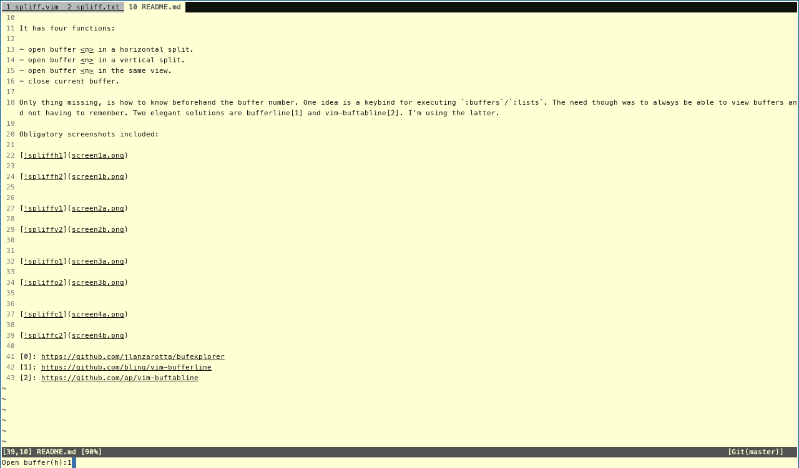
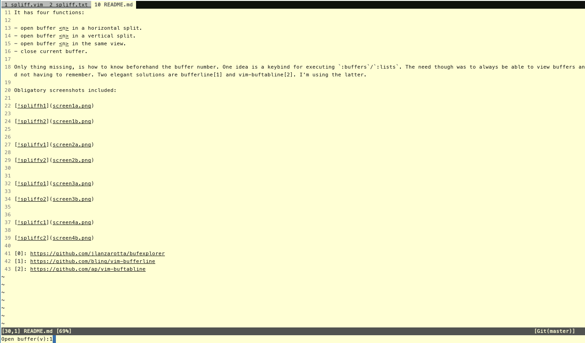
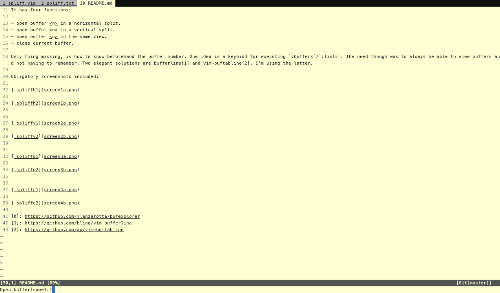
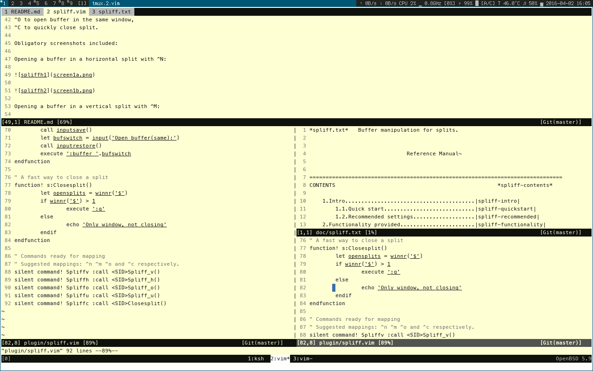

# vim-spliff

Recently, I discovered the vim buffer magic and began replacing my tab workflow with buffers.

While this is a pur-fect feature, I immediately had some problems when working
with large projects. My workflow includes a terminal and one tmux window per
project which holds a vim session with all files loaded in buffers. This was
cumbersome, because each vim session had about 15-20 loaded buffers. There was
a need to be able to switch fast to a buffer or open a buffer in a split.

The first problem was that I needed a way to view all open buffers. Initially,
I tried bufexplorer[0] but the problem was the split management. It was
difficult to control _where_ the split with the buffer I needed will open. So
spli(t) (bu)ff(er) was created.

The idea is pretty simple: from the current view, select a split to open in a
vertical split, horizontal, or in the same view. Well... and a way to close a
split fast if needed.

It has four functions:

- open buffer <n> in a horizontal split.
- open buffer <n> in a vertical split.
- open buffer <n> in the same view.
- close current split.

Only thing missing, is how to know beforehand the buffer number. One idea is a
keybind for executing `:buffers`/`:lists`. The need though was to always be
able to view buffers and not having to remember. Two elegant solutions are
bufferline[1] and vim-buftabline[2]. I'm using the latter.

To use vim-spliff, you need to map included commands. Example:

	set hidden
	nnoremap <C-m> :Spliffv<CR>
	nnoremap <C-n> :Spliffh<CR>
	nnoremap <C-o> :Spliffo<CR>
	nnoremap <C-x> :Spliffc<CR>

^M to open buffer in vertical split,
^N to open buffer in horizontal split,
^O to open buffer in the same window,
^X to quickly close split.

Obligatory screenshots included:

Opening a buffer in a horizontal split with ^N:

Opening a buffer in a vertical split with ^M:

Opening a buffer in the same view with ^O:

When you need to close a split, just press ^C. If no other split exists, it
will _not_ quit vim and output and error in command bar.

[0]: https://github.com/jlanzarotta/bufexplorer
[1]: https://github.com/bling/vim-bufferline
[2]: https://github.com/ap/vim-buftabline
